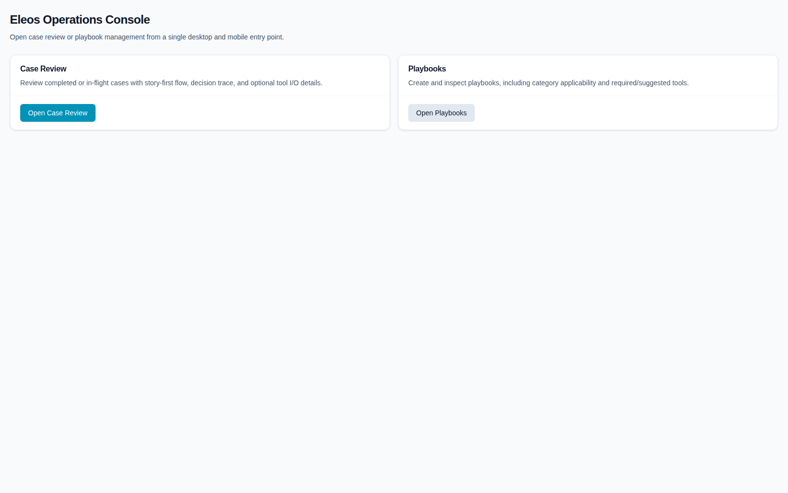
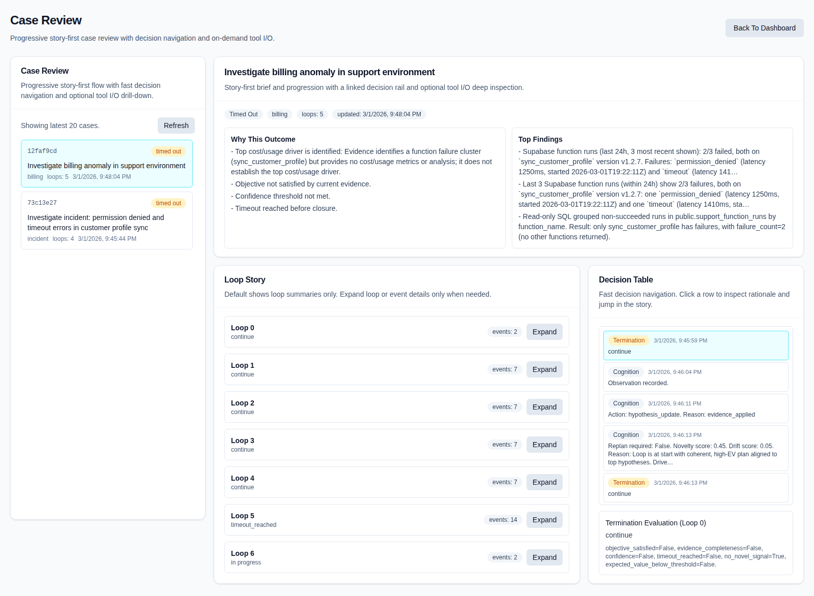
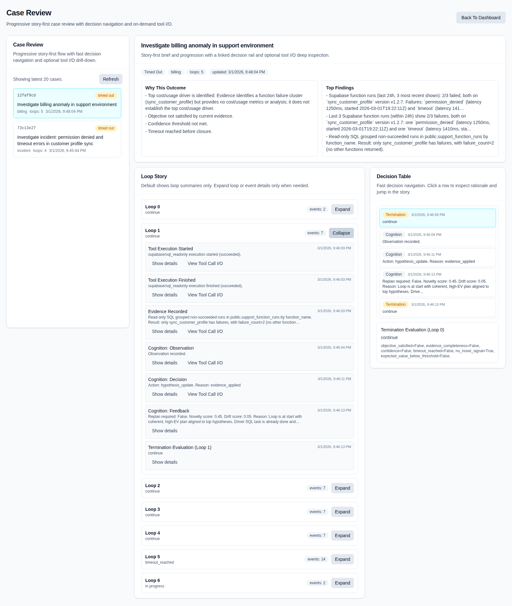
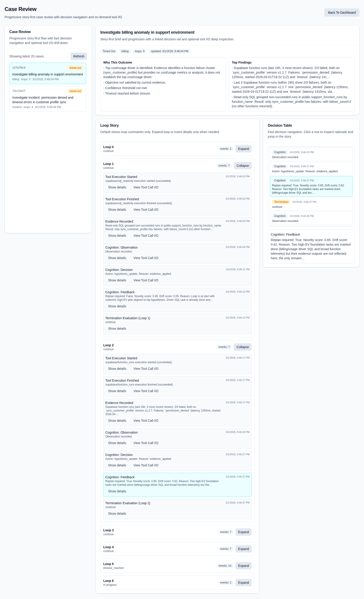
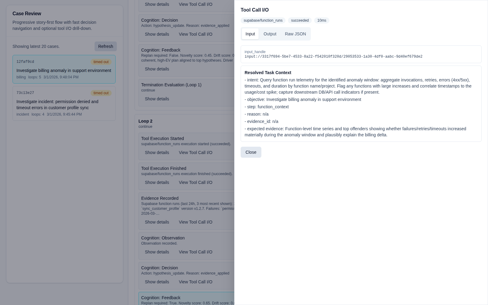

# Evidence-Led Execution for Operational Support (ELEOS)

Fun coincidence: Eleos is also the name of my dog.

ELEOS is an investigation engine for support and operations work:
- hypothesis-led reasoning
- evidence-backed task execution
- decision traceability
- audited outputs

## Project Context

This was coded 100% from my phone via Termux and Codex during the February 2026 Iran Israel conflict from underground shelters in 3 days. This is my wartime coding project.

## Vision

Build an operational copilot that can run long-horizon investigations with:
- metacognitive control loops (including drift detection) so the system keeps progressing instead of wasting time and resources
- category-aware investigation routing, where classification drives strategy and tool selection
- playbooks as operational policy that can seed hypotheses and enforce required step sequences when needed
- configurable MCP-native tool integration so deployments can plug in their own capabilities cleanly
- strong, auditable state consistency with evidence-linked decisions and durable investigation records
- human-readable narratives from first summary to deep technical proof, including on-demand raw tool I/O

## Research Scope

ELEOS was not built from a single framework template. It was designed after broad cross-project research across leading agentic/orchestration ecosystems, with deep-dive comparisons documented in [docs/research/deep-dives](docs/research/deep-dives/). The result is a state-of-the-art agentic investigation engine built with modern LLM-native orchestration patterns on an SOA foundation.

## UI

The UI is centered on one final review flow:
- dashboard entry point
- case review with progressive complexity
- playbook management

Desktop screenshots are included below.

## UI Screenshots (Desktop)

Expand to view desktop screenshots of the final case review UX

### Dashboard

### Case Review (Default, Not Expanded)

### Case Review (Loop Expanded)

### Case Review (Decision Selected)

### Case Review (Tool I/O Drawer)

## Narrative Abilities

From first principles, ELEOS treats explainability as a first-class citizen, with fine-grained data structures and durable persistence as the foundation.

ELEOS explains investigations at multiple layers:
- executive brief: outcome, blockers, top findings
- loop story: what happened each loop and why
- decision trace: critical decisions, rationale, and timing
- deep drill-down: raw tool call inputs/outputs on demand

## Quick Start

Detailed run, API, configuration, MCP, persistence, Supabase E2E, and type-sync instructions are in [Implementation And Usage](docs/implementation-and-usage.md).

## Repo Map

- [src/eleos](src/eleos/): runtime implementation
- [reference-architecture-spec.md](reference-architecture-spec.md): primary architecture spec
- [feedback-overrides.md](feedback-overrides.md): explicit requirement/decision overrides
- [docs/spec](docs/spec/): supporting spec inputs
- [docs/research](docs/research/): research artifacts and deep dives
- [docs](docs/): usage docs and UI screenshots
